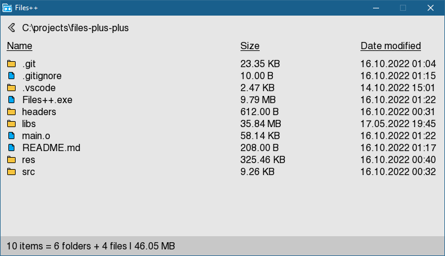

# Files++
Simple file explorer made with SFML and finalized in 30min for a school project.

## Run
`ctrl + shift + b` in Visual Studio Code

## Warning
Don't try to open directories with many subdirectories

## Showcase

